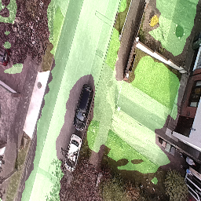
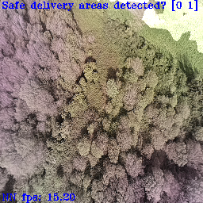

# 🚁 🛬 🧠 🪄 OpenLander 🪄 🧠 🛬 🚁

Completely free Artificial intelligence system for ground-risk mitigation for UAV and AAM.

# 2023/01/03: local image processing and a new DNN 🎉😁

With thanks to Ricardo, you can now add images to the "testpics" folder and process them using an attached Luxonis device by running the test_from_local_file.py script. 
This makes it quicker to test on images collected with your own drone without having to mount the camera.
Note that this runs the neural network on a Luxonis camera that is assumed to be connected over USB, so you will still need a Luxonis device but it can be any model and you don't need to care about having a rolling-shutter camera 😄

The output of the neural network is color-coded and overlayed over your input image in an OpenCV window like this:

(as usual: green mask is "safe", yellow is "obstacle / human", and no mask is "not safe")

# 🎅🔔🎉 2022/12/14: Version 1.0 Xmas release! 🎅🔔🎉

I'm really happy with this version, after about a year of continuous iterations I'm calling this the "V1.0" release, just in time for the Holidays! 
Check out the video below:

https://www.loom.com/share/d83f9f025a5e4c048a2cd63f35f47b82

# How can I use this?

You will need any Luxonis device with an RGB camera and the correct version of the depthai-python library installed for your platform and device combination. In terms of real-world use I would recommend that you get a device with a global shutter RGB camera with high light sensitivity and relatively low optical distortion.

# Practical device recommendations:

If you do not yet own an OAK-series camera from Luxonis and want one to use with this repository, your best bet is to get an OAK-1 device modified with an OV9782 sensor with the "standard FOV".
This is how to do it: 
1. Go to the OAK-1 on the Luxonis store and add it to your cart https://shop.luxonis.com/collections/usb/products/oak-1
2. Go the the "customization coupon" in the Luxonis store and add one of those https://shop.luxonis.com/collections/early-access/products/modification-cupon
3. In your shopping cart, add "please replace RGB sensor with standard FOV OV9782" in the "instructions to seller" box

... and then wait a week or so for your global-shutter, fixed-focus, high-sensitivity sensor to arrive :)

# Why? 

In the amateur and professional UAV space there is a need for simple and cheap tools that can be used to determine safe emergency landing spots, avoiding crashes and potential harm to people.

We are trying to avoid dropping things on people or other obstacles, like this: 

https://user-images.githubusercontent.com/20320678/205611898-bdf4aefa-045e-4f8b-aeb4-b5b7537e1490.mov

# How does it work?

The neural network performs pixelwise segmentation, and is trained from my own pipeline of synthetic data. This public version is trained on about 5Tb of data. If you want a better-performing version of the neural network I may have other variants depending on when the last one was pushed here, feel free to contact me for details :)

->some examples of training images

## Real world pics!

These are unfortunately all made with an old version of the neural network, but I don't have my own drone to make more :-p 
The current gen network performs at least 5x better on a mixed dataset, and is a *huge* step up in real-world use.

(masked area is "landing safe")

# Commercial version

FYI there is a more advanced version of OpenLander that I am developing as a commercial product, which includes depth sensing, IMU, more advanced neural networks, custom-developed sensors and a whole lot more stuff. If you're intersted in that feel free to contact me via email (my name @ gmail), or check out www.abuzz.ai 

Here's a quick screengrab of the stereo system of the commercial version tracking people walking beneath the sensor (this runs in parallel to the DNN system at 30 fps):
https://user-images.githubusercontent.com/20320678/195116938-53e8f701-3f4c-41c0-9dc1-b67f89aa7176.mov

# What about detection of X? Can you update the neural network?

The complete commercial version has more output classes, and additional detection classes can be added on request.
This FOSS version will always only output 3 classes: [obstacle, human, safe].

# Help me improve it!

A full training run costs 5800$ on AWS... so if you'd like to see more in the future feel free to click on the Ko-fi at the bottom of the page!

# Sources:
Some code taken from the excellent https://github.com/luxonis/depthai-experiments from Luxonis.

# Copyright is MIT license
All novel material copyright Stephan Sturges 2022

Permission is hereby granted, free of charge, to any person obtaining a copy of this software and associated documentation files (the "Software"), to deal in the Software without restriction, including without limitation the rights to use, copy, modify, merge, publish, distribute, sublicense, and/or sell copies of the Software, and to permit persons to whom the Software is furnished to do so, subject to the following conditions:
The above copyright notice and this permission notice shall be included in all copies or substantial portions of the Software.
THE SOFTWARE IS PROVIDED "AS IS", WITHOUT WARRANTY OF ANY KIND, EXPRESS OR IMPLIED, INCLUDING BUT NOT LIMITED TO THE WARRANTIES OF MERCHANTABILITY, FITNESS FOR A PARTICULAR PURPOSE AND NONINFRINGEMENT. IN NO EVENT SHALL THE AUTHORS OR COPYRIGHT HOLDERS BE LIABLE FOR ANY CLAIM, DAMAGES OR OTHER LIABILITY, WHETHER IN AN ACTION OF CONTRACT, TORT OR OTHERWISE, ARISING FROM, OUT OF OR IN CONNECTION WITH THE SOFTWARE OR THE USE OR OTHER DEALINGS IN THE SOFTWARE.
