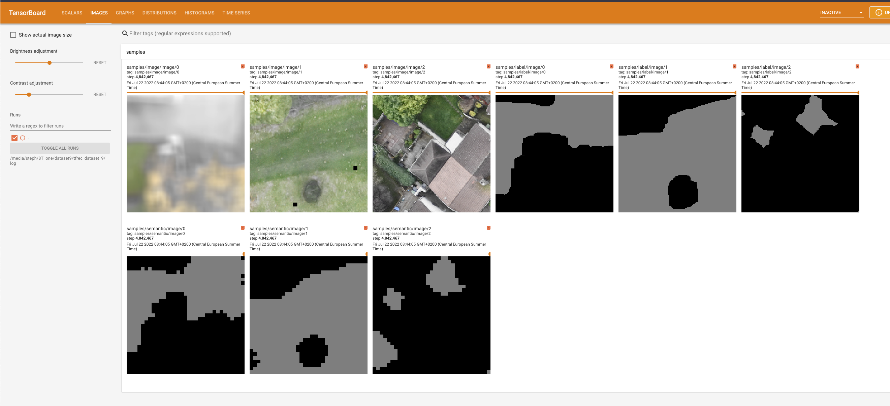
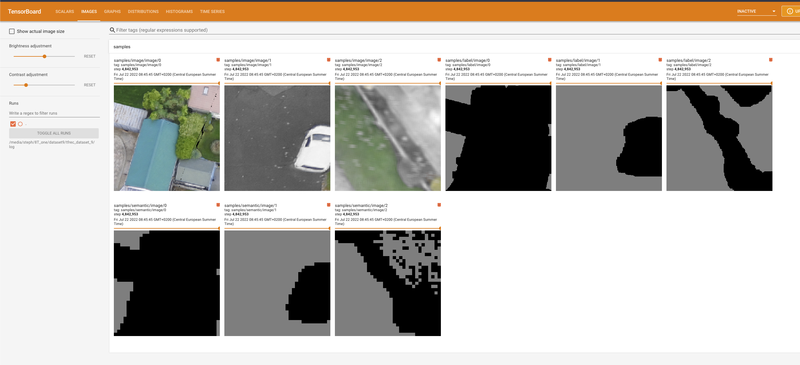
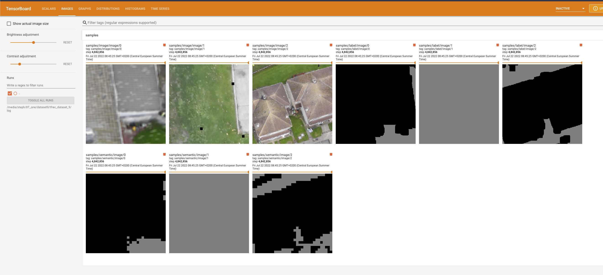
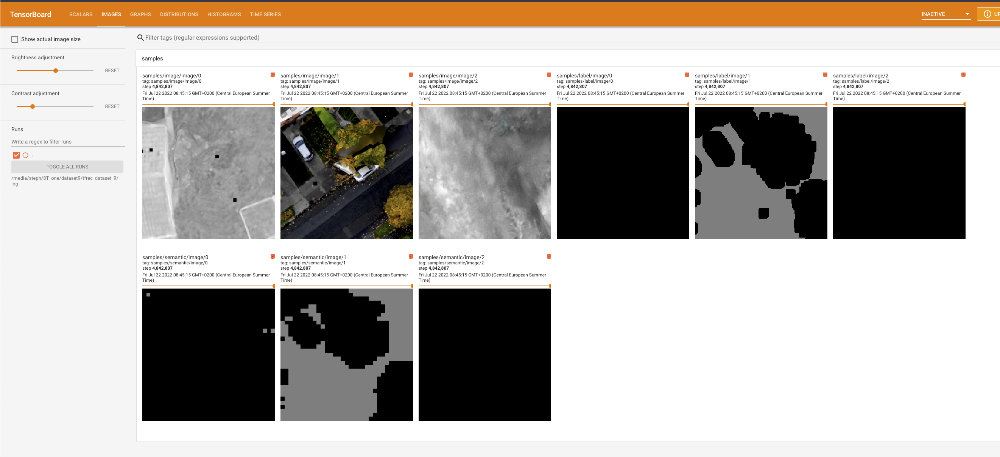
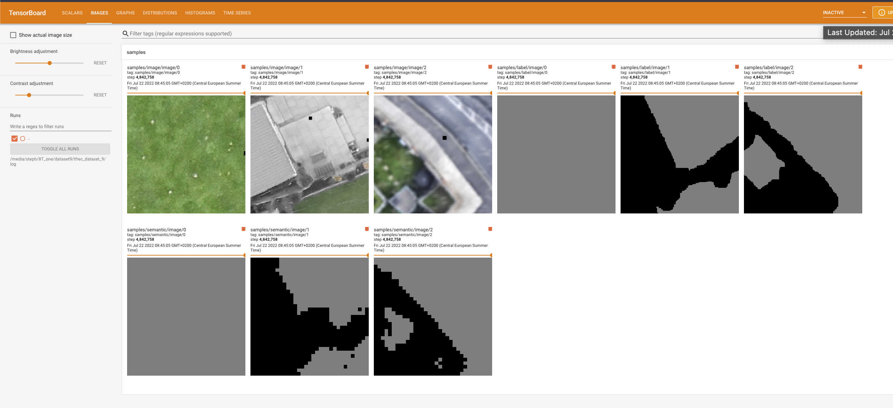
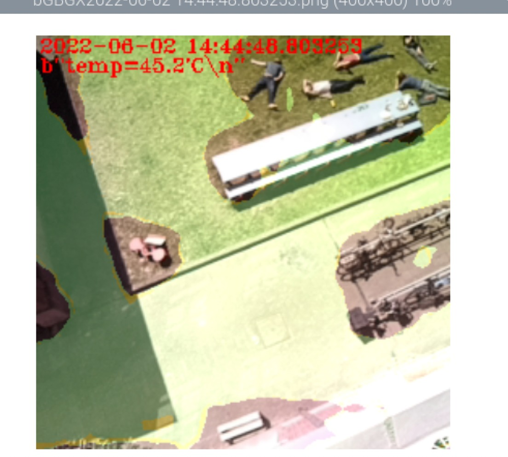

# OpenLander

Free-to-use landing-zone detection for UAV using Luxonis cameras and segmentation AI. 

# Prerequisites:

You will need any Luxonis device with an RGB camera and the correct version of the depthai-python library installed for your platform and device combination. In terms of real-world use I would recommend that you get a device with a global shutter RGB camera with high light sensitivity and relatively low optical distortion.

# Practical device recommendations:

If you do not yet own an OAK-series camera from Luxonis and want one to use with this repository, your best bet is to get an OAK-1 device modified with an OV9782 sensor with the "standard FOV".
This is how to do it: 
1. Go to the OAK-1 on the Luxonis store and add it to your cart https://shop.luxonis.com/collections/usb/products/oak-1
2. Go the the "customization coupon" in the Luxonis store and add one of those https://shop.luxonis.com/collections/early-access/products/modification-cupon
3. In your shopping cart, add "please replace RGB sensor with standard FOV OV9782" in the "instructions to seller" box

... and then wait a week or so for your global-shutter, fixed-focus, high-sensitivity sensor to arrive :)

# Why? 

In the amateur and professional UAV space there is a need for simple and cheap tools that can be used to determine safe emergency landing spots, avoiding crashes and potential harm to people.

# How does it work?

The neural network performs pixelwise segmentation, and is trained from my own pipeline of synthetic data. This public version is trained on about 500Gb of data. There is a new version trained on 4T of data that I may publish soon, if you want to test it just contact me via email.

## some examples of training images

## green is safe

# What about detection of X? Can you update the neural network?

There will be updates in the future, but I am also developing custom versions of the neural network for specific commercial use cases and I won't be adding everything to OpenLander. 
OpenLander will remain free to use and is destined to improving safety of UAVs for all who enjoy using them!

# Sources:
Some code taken from the excellent https://github.com/luxonis/depthai-experiments from Luxonis.

# Copyright is MIT license
Copyright Stephan Sturges 2022

Permission is hereby granted, free of charge, to any person obtaining a copy of this software and associated documentation files (the "Software"), to deal in the Software without restriction, including without limitation the rights to use, copy, modify, merge, publish, distribute, sublicense, and/or sell copies of the Software, and to permit persons to whom the Software is furnished to do so, subject to the following conditions:
The above copyright notice and this permission notice shall be included in all copies or substantial portions of the Software.
THE SOFTWARE IS PROVIDED "AS IS", WITHOUT WARRANTY OF ANY KIND, EXPRESS OR IMPLIED, INCLUDING BUT NOT LIMITED TO THE WARRANTIES OF MERCHANTABILITY, FITNESS FOR A PARTICULAR PURPOSE AND NONINFRINGEMENT. IN NO EVENT SHALL THE AUTHORS OR COPYRIGHT HOLDERS BE LIABLE FOR ANY CLAIM, DAMAGES OR OTHER LIABILITY, WHETHER IN AN ACTION OF CONTRACT, TORT OR OTHERWISE, ARISING FROM, OUT OF OR IN CONNECTION WITH THE SOFTWARE OR THE USE OR OTHER DEALINGS IN THE SOFTWARE.
