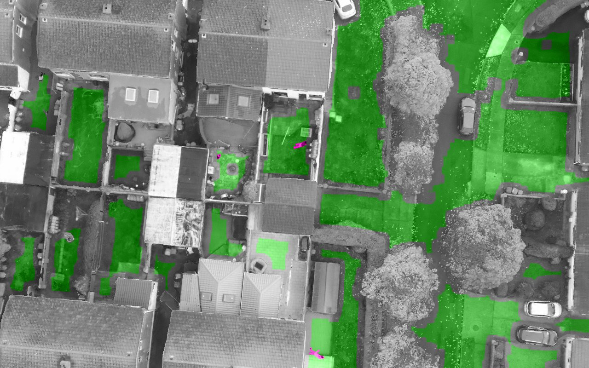
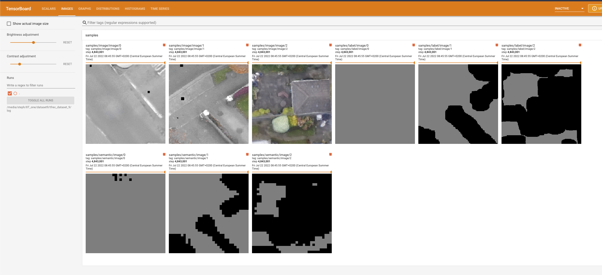
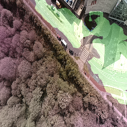
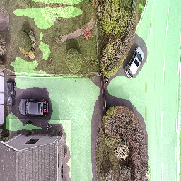

# OpenLander

Free-to-use ground-level obstacle-detection segmentation AI for UAV which you can deploy today using cheap off-the-shelf sensors from Luxonis.

# UPDATE 2022 11 16

Update: pushed a new version of the 3-class segmentation network with much better performance. This network is the result of 26 days of training on 5.5Tb of data!
Next step on the segmentation network is to deploy on larger infrastructure (A100 array on AWS) to train on larger batches and larger input dimensions... stay tuned!

# Preview video with a car park and some people
Check out a short hacky Loom video below showing a demo running locally on a Luxonis camera!!

(CAVEAT: the camera couldn't focus correctly because it's too close to the screen and there is a watermark on the image which messes with detection... but you can see the neural network doing it's thing at a smooth 15fps on a tiny tiny sensor! )

https://www.loom.com/share/7f63cefe2bfb4ab6bc9ac5b1bfd3f7a0

# UPDATE 2022 10 20

Major update! The default neural network now features a 3-class output with detection of humans on a separate output layer! This is to allow finer granularity obstacle avoidance: if you have to fall out of the sky you can now decide whether it's best to drop your drone on top of a building or on someone's head ;) 

Check out the video:

(note: the RGB camera on my sensor is messed up so the neural network input has a strong magenta color-cast, which is not good for detection... but the detection still works quite well. I need to swap out that sensor when I have some time and make a better video.)

I'm hoping this version can also help with other scenarios like disaster relief where having an automated way to find people in the the middle of nowhere can allow you to cover a lot of ground in a short amount of time.
Bear in mind this is V1 of this feature and will get better over time as I can train the neural network on more data and larger batches... speaking of which please click on the ko-fi link below to help keep the GPUs running :) !

# UPDATE 2022 09 20 
New version of the neural network released, trained on x10 more data. This version outputs a single "safe" class. Accuracy is really good :) !

Help me keep the GPUs running with the link below! :) 

# How can I use this?

You will need any Luxonis device with an RGB camera and the correct version of the depthai-python library installed for your platform and device combination. In terms of real-world use I would recommend that you get a device with a global shutter RGB camera with high light sensitivity and relatively low optical distortion.

# Practical device recommendations:

If you do not yet own an OAK-series camera from Luxonis and want one to use with this repository, your best bet is to get an OAK-1 device modified with an OV9782 sensor with the "standard FOV".
This is how to do it: 
1. Go to the OAK-1 on the Luxonis store and add it to your cart https://shop.luxonis.com/collections/usb/products/oak-1
2. Go the the "customization coupon" in the Luxonis store and add one of those https://shop.luxonis.com/collections/early-access/products/modification-cupon
3. In your shopping cart, add "please replace RGB sensor with standard FOV OV9782" in the "instructions to seller" box

... and then wait a week or so for your global-shutter, fixed-focus, high-sensitivity sensor to arrive :)

# Why? 

In the amateur and professional UAV space there is a need for simple and cheap tools that can be used to determine safe emergency landing spots, avoiding crashes and potential harm to people.

# How does it work?

The neural network performs pixelwise segmentation, and is trained from my own pipeline of synthetic data. This public version is trained on about 5Tb of data. If you want a better-performing version of the neural network I may have other variants depending on when the last one was pushed here, feel free to contact me for details :)

## some examples of training images

## Real world pics!

These are unfortunately all made with an old version of the neural network, but I don't have my own drone to make more :-p 
The current gen network performs at least 5x better on a mixed dataset, and is a *huge* step up in real-world use.

(masked area is "landing safe")

## Full-fat version

FYI there is a more advanced version of OpenLander that I am developing as a commercial product, which includes depth sensing, IMU, more advanced neural networks, custom-developed sensors and a whole lot more stuff. If you're intersted in that feel free to contact me via email (my name @ gmail).

Here's a quick screengrab of deconflicting landing spots with depth sensing (this runs in parallel to the DNN system):

https://user-images.githubusercontent.com/20320678/195116938-53e8f701-3f4c-41c0-9dc1-b67f89aa7176.mov

# What about detection of X? Can you update the neural network?

There will be updates in the future, but I am also developing custom versions of the neural network for specific commercial use cases and I won't be adding everything to OpenLander. 
OpenLander will remain free to use and is destined to improving safety of UAVs for all who enjoy using them!

# Sources:
Some code taken from the excellent https://github.com/luxonis/depthai-experiments from Luxonis.

# Copyright is MIT license
Copyright Stephan Sturges 2022

Permission is hereby granted, free of charge, to any person obtaining a copy of this software and associated documentation files (the "Software"), to deal in the Software without restriction, including without limitation the rights to use, copy, modify, merge, publish, distribute, sublicense, and/or sell copies of the Software, and to permit persons to whom the Software is furnished to do so, subject to the following conditions:
The above copyright notice and this permission notice shall be included in all copies or substantial portions of the Software.
THE SOFTWARE IS PROVIDED "AS IS", WITHOUT WARRANTY OF ANY KIND, EXPRESS OR IMPLIED, INCLUDING BUT NOT LIMITED TO THE WARRANTIES OF MERCHANTABILITY, FITNESS FOR A PARTICULAR PURPOSE AND NONINFRINGEMENT. IN NO EVENT SHALL THE AUTHORS OR COPYRIGHT HOLDERS BE LIABLE FOR ANY CLAIM, DAMAGES OR OTHER LIABILITY, WHETHER IN AN ACTION OF CONTRACT, TORT OR OTHERWISE, ARISING FROM, OUT OF OR IN CONNECTION WITH THE SOFTWARE OR THE USE OR OTHER DEALINGS IN THE SOFTWARE.
